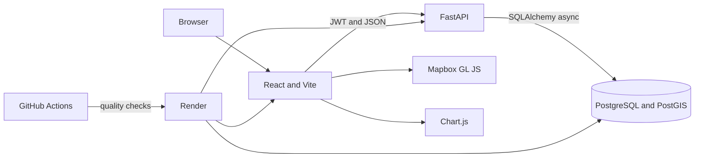
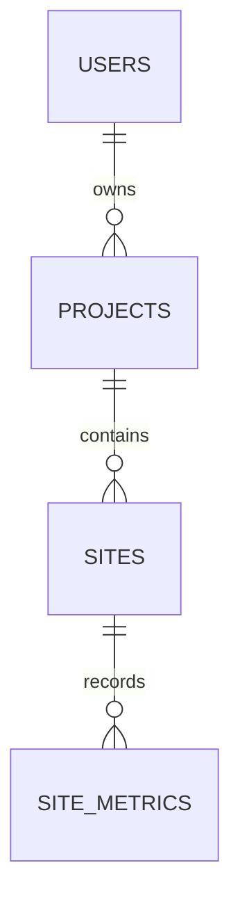

# Darukaa.Earth

Darukaa.Earth is a full-stack geospatial analytics platform for managing carbon and biodiversity projects. Administrators can register, create projects, draw site boundaries on satellite terrain, and track site-level carbon, biodiversity, and vegetation measurements over time.

Repository: [github.com/Andes-indica/Darukaa](https://github.com/Andes-indica/Darukaa)

## Product capabilities

- JWT registration, login, and protected sessions
- Ownership-scoped project CRUD with search, filters, and pagination
- Interactive Mapbox satellite and terrain workspace
- Polygon creation, editing, validation, and equal-area hectare calculation
- Site observations for stored carbon, biodiversity, and vegetation cover
- Chart.js performance trends, summary statistics, and observation audit trail
- CSV export of the visible project portfolio
- Responsive desktop and mobile layouts
- Automated formatting, linting, tests, builds, migrations, and deployment gates

## Architecture



The frontend and API are separate deployable services. FastAPI owns authentication, authorization, validation, and analytics calculations. PostgreSQL stores relational records, while PostGIS stores site polygons and performs spatial area calculations. The frontend loads the map and analytics workspaces lazily so the dashboard remains responsive.

## Technology stack

| Layer              | Technology                            |
| ------------------ | ------------------------------------- |
| Frontend           | React 18, TypeScript, Vite            |
| Mapping            | Mapbox GL JS                          |
| Visualization      | Chart.js and react-chartjs-2          |
| Backend            | FastAPI, Pydantic, SQLAlchemy async   |
| Geospatial         | PostGIS, GeoAlchemy2, Shapely         |
| Database           | PostgreSQL 16                         |
| Authentication     | JWT, Argon2 password hashing          |
| Migrations         | Alembic                               |
| Quality automation | ESLint, Prettier, Ruff, pytest, Husky |
| CI and deployment  | GitHub Actions and Render Blueprint   |

## Repository layout

```text
apps/
  api/                    FastAPI application, migrations, and tests
  web/                    React application
docs/
  DEPLOYMENT.md           Render deployment and verification guide
infra/postgres/           Local PostGIS initialization
.github/workflows/ci.yml  CI quality pipeline
render.yaml               Production infrastructure blueprint
```

## Database schema



| Table          | Important fields                                                                  | Constraints and indexes                                                |
| -------------- | --------------------------------------------------------------------------------- | ---------------------------------------------------------------------- |
| `users`        | UUID, email, full name, password hash, role, active state                         | Unique email                                                           |
| `projects`     | UUID, owner UUID, name, type, status, start and end dates                         | Owner and status indexes; cascading owner relationship                 |
| `sites`        | UUID, project UUID, name, PostGIS polygon, hectares, status                       | GiST boundary index; cascading project relationship                    |
| `site_metrics` | UUID, site UUID, metric type, numeric value, unit, observed time, optional source | Unique site, metric, and timestamp tuple; site and observation indexes |

All primary keys are UUIDs. Site boundaries use WGS84 (`EPSG:4326`). The API transforms polygons to the World Equidistant Cylindrical equal-area CRS (`EPSG:6933`) before calculating hectares with `ST_Area(...) / 10000`.

Deleting an owner cascades to projects, sites, and observations. Requests for another user's resources return `404`, preventing resource-existence disclosure.

## Analytics data model

The challenge permits mock or user-provided datasets. This implementation uses administrator-entered observations because it keeps data provenance explicit and lets reviewers test the complete workflow without depending on an external environmental-data API.

| Metric             | Canonical unit | Validation                         |
| ------------------ | -------------- | ---------------------------------- |
| Stored carbon      | `tCO2e`        | Non-negative                       |
| Biodiversity index | `index`        | Non-negative project-defined score |
| Vegetation cover   | `%`            | Between 0 and 100                  |

The server assigns units, requires timezone-aware timestamps, rejects duplicate observations, and calculates latest value, previous value, absolute change, percentage change, minimum, maximum, and average. The browser does not provide trusted summary values.

## Local setup

Prerequisites:

- Node.js 20 or newer
- Python 3.12 or newer
- [uv](https://docs.astral.sh/uv/)
- Docker and Docker Compose
- A public Mapbox access token

1. Clone the repository and enter it:

   ```bash
   git clone https://github.com/Andes-indica/Darukaa.git
   cd Darukaa
   ```

2. Create the environment file:

   ```bash
   cp .env.example .env
   ```

   Replace `VITE_MAPBOX_TOKEN` and `JWT_SECRET`. If port `5432` is already occupied, either stop the conflicting PostgreSQL process or change the host side of the database port mapping and update `DATABASE_URL`.

3. Start PostGIS:

   ```bash
   docker compose up -d database
   docker compose ps
   ```

4. Install dependencies:

   ```bash
   npm install
   uv sync --project apps/api --dev
   ```

5. Apply migrations:

   ```bash
   uv run --project apps/api alembic -c apps/api/alembic.ini upgrade head
   ```

6. Start the frontend and API:

   ```bash
   npm run dev
   ```

Open `http://localhost:5173`. FastAPI documentation is available at `http://localhost:8000/docs`.

## Reviewer walkthrough

1. Register a new administrator account.
2. Create a carbon, biodiversity, or mixed project.
3. Select the crosshair button in the project row to open its map workspace.
4. Choose **Draw polygon**, add at least three vertices, and finish the polygon.
5. Save the site and select **Analytics** beside it.
6. Add two observations of the same metric with different timestamps.
7. Confirm the line chart and change summary update.
8. Return to the dashboard and use **Export report** to download the project CSV.

No shared credentials are required because registration is enabled.

## Quality checks

```bash
npm run format:check
npm run lint
npm test
```

The local test command runs the backend suite and a production frontend build. With `TEST_DATABASE_URL` configured, pytest also runs the complete registration, project, PostGIS polygon, observation, analytics, database-health, and cascade-deletion flow.

Husky runs lint-staged before each commit:

- Prettier for frontend, JSON, Markdown, and YAML files
- ESLint for TypeScript and React files
- Ruff linting and formatting for Python files

## CI and CD pipeline

The GitHub Actions workflow runs for pull requests and every push to `main`:

1. Start PostgreSQL 16 with PostGIS.
2. Install deterministic frontend and backend dependencies.
3. Apply the Alembic migration to the CI database.
4. Verify Prettier and Ruff formatting.
5. Run ESLint and Ruff linting.
6. Run unit, ownership, validation, and real PostGIS integration tests.
7. Type-check and build the production React bundle.

Third-party actions are pinned to full commit SHAs. Render services use `autoDeployTrigger: checksPass`, so a new version deploys only after the GitHub quality workflow succeeds. The API pre-deploy command applies database migrations before the new service version starts.

## Production deployment

The root [`render.yaml`](render.yaml) provisions:

- A React static site on Render's CDN
- A FastAPI web service with health checks
- A private PostgreSQL 16 database with PostGIS enabled by Alembic
- Generated production JWT credentials
- Automatic deployment after passing GitHub checks

Follow [the deployment and verification guide](docs/DEPLOYMENT.md). The first Blueprint setup requires three environment values: the public frontend origin, the public API URL, and a Mapbox token.

## API summary

| Method | Endpoint                                                    | Purpose                               |
| ------ | ----------------------------------------------------------- | ------------------------------------- |
| GET    | `/api/v1/health`                                            | API liveness                          |
| GET    | `/api/v1/health/database`                                   | Database and PostGIS readiness        |
| POST   | `/api/v1/auth/register`                                     | Register and receive a JWT            |
| POST   | `/api/v1/auth/login`                                        | Authenticate                          |
| GET    | `/api/v1/auth/me`                                           | Read the current identity             |
| POST   | `/api/v1/projects`                                          | Create a project                      |
| GET    | `/api/v1/projects`                                          | Search, filter, and paginate projects |
| PATCH  | `/api/v1/projects/{id}`                                     | Update a project                      |
| DELETE | `/api/v1/projects/{id}`                                     | Delete a project                      |
| POST   | `/api/v1/projects/{id}/sites`                               | Create a polygon site                 |
| GET    | `/api/v1/projects/{id}/sites`                               | List project sites                    |
| PATCH  | `/api/v1/projects/{id}/sites/{site_id}`                     | Update a site or polygon              |
| DELETE | `/api/v1/projects/{id}/sites/{site_id}`                     | Delete a site                         |
| POST   | `/api/v1/projects/{id}/sites/{site_id}/metrics`             | Add an observation                    |
| GET    | `/api/v1/projects/{id}/sites/{site_id}/metrics`             | List or filter observations           |
| GET    | `/api/v1/projects/{id}/sites/{site_id}/metrics/analytics`   | Calculate site trends                 |
| DELETE | `/api/v1/projects/{id}/sites/{site_id}/metrics/{metric_id}` | Delete an observation                 |

## Security and trade-offs

- Passwords use Argon2 and are never returned by the API.
- JWT access tokens expire after 30 minutes by default.
- Production startup rejects the repository's development JWT secret.
- Database URLs supplied by managed providers are normalized to the asyncpg driver.
- CORS uses an explicit production frontend origin.
- The browser stores the short-lived access token in local storage for this time-boxed MVP. A production identity system should use refresh-token rotation with Secure, HttpOnly, SameSite cookies.
- Site observations are manual and auditable. Automatic satellite ingestion is intentionally outside the hackathon scope and would require data-quality, cloud-cover, and provenance controls.
- Free hosting is appropriate for review but can cold-start or expire. A persistent production workload should use paid compute and database backups.

## Milestones

1. Foundation and developer experience - complete
2. Database schema and JWT authentication - complete
3. Project dashboard and protected CRUD - complete
4. Mapbox polygon workflow and PostGIS storage - complete
5. Site performance analytics with Chart.js - complete
6. Integration testing, deployment automation, and submission documentation - in progress until the first public deployment is verified
