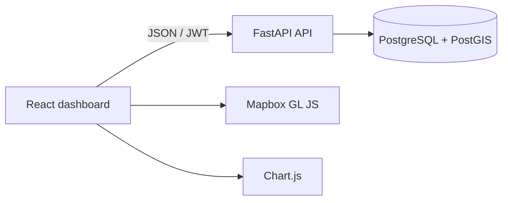

# Darukaa.Earth

A full-stack geospatial dashboard for creating, mapping, and monitoring carbon and biodiversity projects. This implementation follows the Darukaa.Earth full-stack hackathon brief.

## Current milestone

Milestone 1 establishes the project foundation:

- React + TypeScript frontend with a responsive dashboard shell
- FastAPI backend with OpenAPI documentation and health endpoints
- PostgreSQL 16 + PostGIS development database
- Shared environment configuration
- ESLint, Prettier, Ruff, Husky, and lint-staged quality checks
- API smoke test and GitHub Actions CI

## Architecture



The frontend and backend are separate applications so they can be deployed and scaled independently. FastAPI owns authentication and business rules. PostgreSQL stores relational data while PostGIS provides polygon validation, spatial queries, and area calculations.

## Repository layout

```text
apps/
  api/        FastAPI service and tests
  web/        React/Vite application
infra/
  postgres/   Local PostGIS initialization
.github/      CI workflows
```


## Local setup

Prerequisites: Node.js 20+, Python 3.12+, [uv](https://docs.astral.sh/uv/), and Docker Compose.

1. Copy the environment template:

   ```bash
   cp .env.example .env
   ```

2. Add a Mapbox public token to `VITE_MAPBOX_TOKEN` in `.env`.

3. Start PostGIS:

   ```bash
   docker compose up -d database
   ```

4. Install dependencies:

   ```bash
   npm install
   uv sync --project apps/api --dev
   ```

5. Start both applications:

   ```bash
   npm run dev
   ```

The frontend runs at `http://localhost:5173`; the API documentation is at `http://localhost:8000/docs`.

## Quality checks

```bash
npm run lint
npm test
```

Husky runs lint-staged before each commit, applying Prettier and ESLint to frontend files and Ruff to Python files. GitHub Actions repeats linting, backend tests, and the frontend production build for pull requests and pushes to `main`.

## API endpoints available now

| Method | Endpoint                  | Purpose                    |
| ------ | ------------------------- | -------------------------- |
| GET    | `/api/v1/health`          | API liveness check         |
| GET    | `/api/v1/health/database` | PostGIS connectivity check |

## Planned milestones

1. Foundation and developer experience (complete)
2. Database schema and JWT registration/login
3. Project management dashboard and CRUD
4. Mapbox polygon drawing and PostGIS storage
5. Site analytics with Chart.js
6. Full test suite, deployment workflows, documentation, and submission document
