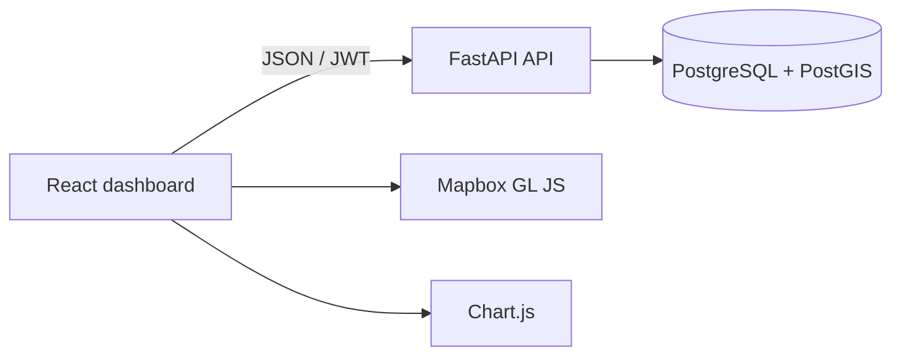

# Darukaa.Earth

A full-stack geospatial dashboard for creating, mapping, and monitoring carbon and biodiversity projects. This implementation follows the Darukaa.Earth full-stack hackathon brief.

## Current milestone

Milestones 1 through 4 establish the application foundation, security model, project management, and geospatial workflow:

- React + TypeScript frontend with a responsive dashboard shell
- FastAPI backend with OpenAPI documentation and health endpoints
- PostgreSQL 16 + PostGIS development database
- Shared environment configuration
- ESLint, Prettier, Ruff, Husky, and lint-staged quality checks
- API smoke test and GitHub Actions CI
- SQLAlchemy models for users, projects, sites, and time-series metrics
- Alembic migration with UUID keys, enum constraints, cascading relationships, and a PostGIS polygon index
- Argon2 password hashing and short-lived JWT access tokens
- Registration, login, and protected profile endpoints
- Ownership-scoped project create, read, update, and delete endpoints
- Search, project type/status filters, and paginated project results
- Live React authentication flow, session restoration, and project management dashboard
- Protected site CRUD nested under project ownership
- GeoJSON polygon validation with Shapely before database writes
- Mapbox Draw workspace for creating and editing project boundaries
- PostGIS geometry storage and equal-area hectare calculation
- Live site counts on project responses and the dashboard

## Architecture



The frontend and backend are separate applications so they can be deployed and scaled independently. FastAPI owns authentication and business rules. PostgreSQL stores relational data while PostGIS provides polygon validation, spatial queries, and area calculations.

## Repository layout

```text
apps/
  api/        FastAPI service and tests
  web/        React/Vite application
infra/
  postgres/   Local PostGIS initialization
.github/      CI workflows
```

## Local setup

Prerequisites: Node.js 20+, Python 3.12+, [uv](https://docs.astral.sh/uv/), and Docker Compose.

1. Copy the environment template:

   ```bash
   cp .env.example .env
   ```

2. Add a Mapbox public token to `VITE_MAPBOX_TOKEN` in `.env`.

3. Start PostGIS:

   ```bash
   docker compose up -d database
   ```

4. Install dependencies:

   ```bash
   npm install
   uv sync --project apps/api --dev
   ```

5. Apply the database migration:

   ```bash
   uv run --project apps/api alembic -c apps/api/alembic.ini upgrade head
   ```

6. Start both applications:

   ```bash
   npm run dev
   ```

The frontend runs at `http://localhost:5173`; the API documentation is at `http://localhost:8000/docs`.

## Quality checks

```bash
npm run lint
npm test
```

Husky runs lint-staged before each commit, applying Prettier and ESLint to frontend files and Ruff to Python files. GitHub Actions repeats linting, backend tests, and the frontend production build for pull requests and pushes to `main`.

## API endpoints available now

| Method | Endpoint                                | Purpose                               |
| ------ | --------------------------------------- | ------------------------------------- |
| GET    | `/api/v1/health`                        | API liveness check                    |
| GET    | `/api/v1/health/database`               | PostGIS connectivity check            |
| POST   | `/api/v1/auth/register`                 | Create an account and receive a JWT   |
| POST   | `/api/v1/auth/login`                    | Authenticate using OAuth2 form data   |
| GET    | `/api/v1/auth/me`                       | Return the authenticated user         |
| POST   | `/api/v1/projects`                      | Create an owned project               |
| GET    | `/api/v1/projects`                      | Search, filter, and paginate projects |
| GET    | `/api/v1/projects/{id}`                 | Read an owned project                 |
| PATCH  | `/api/v1/projects/{id}`                 | Update an owned project               |
| DELETE | `/api/v1/projects/{id}`                 | Delete an owned project               |
| POST   | `/api/v1/projects/{id}/sites`           | Create a polygon site                 |
| GET    | `/api/v1/projects/{id}/sites`           | List the project's sites              |
| GET    | `/api/v1/projects/{id}/sites/{site_id}` | Read a site                           |
| PATCH  | `/api/v1/projects/{id}/sites/{site_id}` | Update site data or polygon           |
| DELETE | `/api/v1/projects/{id}/sites/{site_id}` | Delete a site                         |

## Database schema

| Table          | Purpose                                 | Important fields                           |
| -------------- | --------------------------------------- | ------------------------------------------ |
| `users`        | Administrator and analyst identities    | email, password hash, role, active state   |
| `projects`     | Carbon or biodiversity initiatives      | owner, type, status, dates                 |
| `sites`        | Geographic areas belonging to a project | PostGIS polygon, calculated area, status   |
| `site_metrics` | Time-series measurements for analytics  | metric type, value, unit, observation time |

All primary keys are UUIDs. Deleting a user removes owned projects; deleting a project removes its sites and measurements. Site boundaries use WGS84 (`SRID 4326`) and a GiST spatial index.

Project queries are scoped to the authenticated owner. Requests for another user's project return `404` so the API does not reveal whether that resource exists.

Site polygons arrive as GeoJSON in WGS84 (`EPSG:4326`). The API validates ring closure, coordinate bounds, non-zero area, and polygon topology before storing the geometry. PostGIS transforms each polygon to the World Equidistant Cylindrical equal-area CRS (`EPSG:6933`) and calculates hectares using `ST_Area(...) / 10000`.

For this hackathon MVP, the browser keeps the short-lived access token in local storage. A production deployment should move refresh tokens into Secure, HttpOnly, SameSite cookies and apply a restrictive Content Security Policy.

### Authentication example

```bash
curl -X POST http://localhost:8000/api/v1/auth/register \
  -H 'Content-Type: application/json' \
  -d '{"email":"admin@example.com","full_name":"Admin User","password":"secure-password-123"}'

curl -X POST http://localhost:8000/api/v1/auth/login \
  -H 'Content-Type: application/x-www-form-urlencoded' \
  -d 'username=admin@example.com&password=secure-password-123'
```

## Planned milestones

1. Foundation and developer experience (complete)
2. Database schema and JWT registration/login (complete)
3. Project management dashboard and CRUD (complete)
4. Mapbox polygon drawing and PostGIS storage (complete)
5. Site analytics with Chart.js
6. Full test suite, deployment workflows, documentation, and submission document
